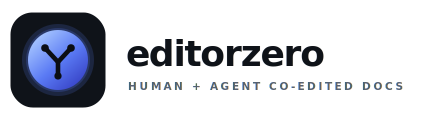

 
 

**AI-native, self-hostable docs. Humans and agents as peer co-editors.**

One capability layer. Four surfaces: API · CLI · MCP · Web UI. Full parity, enforced.

> 🧪 **A real production experiment in complex agentic engineering.** Every line of code, every ADR, every architectural decision is driven end-to-end by Anthropic's new Opus 4.7 model.

[Status](#-status) · [What It Is](#-what-is-editorzero) · [Experiment](#-the-experiment) · [Invariants](#️-hard-invariants) · [Parity](#-four-surface-parity) · [Roadmap](#️-roadmap) · [Contributing](#-contributing)

---

## 🚧 Status

**Work in progress. No runnable artifact yet.** The platform is currently in **Phase 3 — verification harness + first slice**.

| Phase | What | State |
|---|---|---|
| **0** · Orient | Brief, invariants, working assumptions | ✅ Closed |
| **1** · Research + ADRs | 20 ADRs, cross-model red-team | ✅ Closed |
| **2** · Architecture | End-to-end design, 3 red-team passes (incl. cross-model Opus + Codex) | ✅ Closed |
| **3** · Verification harness + first slice | Types / lint / unit / property / contract / e2e — "create doc, read doc" | 🏗 In progress |
| **4** · Feature slices | Full capability surface across all four adapters | — |
| **5** · Hardening + launch | Security pass, load tests, runbook, threat model | — |

Rolling work state in [`docs/continuation.md`](docs/continuation.md).

---

## ✨ What Is editorzero?

editorzero is an **open-source, self-hostable, Markdown-first documentation and collaboration platform** where human users and AI agents are **peer co-editors** — not a human product with agent bolted on.

- **Agent-first, not agent-retrofitted.** Every layer (auth, identity, attribution, audit, quotas, recoverability) treats agents as distinct principals with their own tokens, rate limits, and trace identities.
- **Four-surface parity as a hard constraint.** API, CLI, MCP server, and Web UI are adapters over a single capability layer. Contract tests enforce the matrix; unchecked type-compatible cells fail the build.
- **Markdown round-trip determinism.** The CRDT document model maps losslessly to a canonical Markdown AST. Property tests prove `md → crdt → md` is a fixed point.
- **Deployable with one command.** SQLite for single-node self-hosts; Postgres for production (target: 500–1,000 users per instance, design headroom for 10,000).

Editor quality targeted at **Linear docs, Notion, Craft**.

---

## 🧪 The Experiment

editorzero is a **real production experiment in complex agentic engineering.**

Every line of code, every ADR, every architectural decision, every red-team pass is **authored end-to-end by Anthropic's new Opus 4.7 (1M-context)** under @numman's review at phase boundaries. It is not a demo, not a toy, not assistant-polished human scaffolding — it's a live attempt to see how far a single frontier model can carry a multi-surface, CRDT-backed, audit-complete, self-hostable platform from Phase 0 orientation through production hardening.

What's being stress-tested:

- **Autonomous phase progression.** Human review at boundaries, not per-commit.
- **Self-critique loops.** Red-team sub-agents find blockers before they ship (F1–F93 and counting across four passes).
- **Cross-model validation at high stakes.** Opus + Codex on Phase 2 pass #3 caught 3 BLOCKERs neither found alone — one was invalid SQL a single-model review missed entirely.
- **Code-as-spec over prose-as-spec.** Types and property tests are canonical; ADRs explain *why*, not *how*.
- **Drift-prevention.** Coherence scripts at pre-commit, registry-derived adapters, single source of truth per concern.

The repo history is the ledger. Every commit is attributable; every architectural decision has an ADR with alternatives considered; every invariant is enforced in code, not prose.

---

## 🧠 Why This Looks Different

Five reframings shape the architecture. Each one rules out a whole class of shortcuts.

1. **Agent-first is the whole architecture, not a feature.** Retrofitting identity, quotas, and attribution later is how "agent support" becomes a toy.
2. **Four-surface parity is the center-of-gravity constraint.** If any surface has bespoke mutation logic, we've lost. Contract tests generated from the capability registry enforce the matrix.
3. **Markdown round-trip determinism is the hard test.** Editors that model their DOM as "whatever looks right in the browser" fail here. The CRDT must map losslessly to a canonical Markdown AST.
4. **Humans + agents editing simultaneously = CRDT convergence AND editor correctness.** Programmatic edits concurrent with keystrokes cannot flicker, lose cursor state, or corrupt the CRDT.
5. **Taste is table stakes for docs.** Slash commands, table UX, drag-and-drop, paste handling, collab cursors, and hierarchy navigation are where users decide whether to stay.

Full framing in [`docs/brief.md`](docs/brief.md).

---

## 🛡️ Hard Invariants

Property tests enforce these from Phase 3 onward. A build that violates one doesn't land.

1. **Markdown fidelity** — per-block Markdown round-trips cleanly under its declared tier.
2. **Convergence** — any mix of concurrent human/agent edits converges across replicas via the CRDT.
3. **Audit completeness** — every mutation produces exactly one audit entry; the audit log alone reconstructs final state.
4. **Surface parity** — every capability exists on every type-compatible surface. No exceptions.
5. **Permission uniformity** — no mutation or tenant-scoped read is reachable without a permission check; no surface re-implements that logic.
6. **Recoverable soft-delete** — soft-deletes are recoverable via a first-class capability; hard-deletes are separate, audited, never silent.
7. **Single write path** — content mutations flow through the CRDT via `ctx.transact(doc_id, fn)`; metadata mutations are dispatcher-tx-only and enumerated explicitly.
8. **Agent principals are first-class** — distinct rate limits, audit attribution, and revocation. Not shared user tokens.

---

## 🔭 Four-Surface Parity

One capability layer. Every surface is a generated adapter over it.

| Capability | API | CLI | MCP | Web UI |
|---|:---:|:---:|:---:|:---:|
| `doc.list` | 🟡 | 🟡 | 🟡 | 🟡 |
| `doc.create` | — | — | — | — |
| `doc.read` | — | — | — | — |
| `doc.rename` | — | — | — | — |
| `doc.publish` / `unpublish` | — | — | — | — |
| `doc.move` | — | — | — | — |
| `block.set_visibility` | — | — | — | — |
| `collection.*` | — | — | — | — |
| `agent.token.rotate` | — | — | — | — |
| *… full matrix in [`docs/architecture.md`](docs/architecture.md)* | | | | |

**Legend:** 🟡 kernel landed, adapters pending · ✅ landed + contract-tested · — not yet implemented

Contract tests generated from the capability registry enforce the matrix. Unchecked type-compatible cells fail the build.

---

## ✅ Verification Stack

Every change passes, in order, **locally via pre-commit hooks** — no separate CI bottleneck at this phase.

1. **Types** — `tsc --noEmit` clean across the monorepo
2. **Lint + format** — zero warnings (Biome)
3. **Unit tests** — pure logic
4. **Property tests** — CRDT convergence, Markdown fidelity, inverse-restore, permission invariants, capability-matrix parity
5. **Integration tests** — capabilities against real SQLite **and** real Postgres
6. **Contract tests** — API/CLI/MCP/UI parity matrix, generated from the capability registry
7. **E2E tests** — Playwright + `@axe-core/playwright` for WCAG 2.1 AA
8. **Smoke deploy** — ephemeral `docker compose` env, hit `/health`, create a doc, tear down
9. **Observability check** — traces export, no unexpected error spans

"Fix it in the next commit" is not acceptable; the hook doesn't let it land. Steps 3–9 light up as Phase 3 lands the test harness and the first slice.

---

## 🗺️ Roadmap

See the phase table in [Status](#-status). Detailed ordering and current sub-slice lives in [`docs/continuation.md`](docs/continuation.md).

---

## 📚 Documentation

| File | What it holds |
|---|---|
| [`AGENTS.md`](AGENTS.md) | Canonical working practices, invariants, verification stack, gotchas |
| [`docs/continuation.md`](docs/continuation.md) | Rolling work state — current phase, focus, open questions |
| [`docs/brief.md`](docs/brief.md) | Phase 0 framing — reframings, invariants, assumptions |
| [`docs/adr/`](docs/adr/) | One file per architectural decision (0001–0020) + red-team disposition docs |
| [`docs/architecture.md`](docs/architecture.md) | Phase 2 end-to-end system design |
| [`CONTRIBUTING.md`](CONTRIBUTING.md) | Contributor onboarding + DCO instructions |
| [`SECURITY.md`](SECURITY.md) | Security reporting |
| [`CHANGELOG.md`](CHANGELOG.md) | Per-release notes |

<strong>Architectural stack at a glance</strong>

| Layer | Choice | ADR |
|---|---|---|
| Backend runtime | Node 22 LTS + TypeScript | [0002](docs/adr/0002-backend-runtime.md) |
| CRDT | Yjs | [0003](docs/adr/0003-crdt-library.md) |
| Rich-text editor | BlockNote | [0004](docs/adr/0004-rich-text-editor.md) |
| UI framework | Next.js 16 | [0005](docs/adr/0005-ui-framework.md) |
| Realtime transport | Hocuspocus (WebSocket) + stdio/HTTP-SSE for MCP | [0006](docs/adr/0006-realtime-transport.md) |
| Database | Postgres (prod) + SQLite (self-host) via Kysely | [0007](docs/adr/0007-database-strategy.md) |
| Search | Postgres FTS + pgvector / sqlite-vec | [0008](docs/adr/0008-search.md) |
| MCP SDK | Official `@modelcontextprotocol/sdk` 1.x | [0009](docs/adr/0009-mcp-sdk-and-capability-design.md) |
| SSO | Better Auth | [0010](docs/adr/0010-sso.md) |
| Custom domains / TLS | Caddy + ACME | [0011](docs/adr/0011-custom-domains-tls.md) |
| Deploy artifact | `docker compose` + single container | [0012](docs/adr/0012-deploy-artifact.md) |
| Block model | Per-block Markdown fidelity tiers | [0013](docs/adr/0013-block-model.md) |
| Job queue | pg-boss (prod) / in-process (SQLite) | [0014](docs/adr/0014-job-queue.md) |
| Permissions | Capability-layer enforcement, `AccessPath.selector` reserved | [0015](docs/adr/0015-permission-enforcement.md) |
| Principal model | Polymorphic (`kind ∈ {user, agent}`) | [0016](docs/adr/0016-principal-model.md) |
| Soft-delete | First-class recoverable capability | [0017](docs/adr/0017-soft-delete-recovery.md) |
| Write path | Single `ctx.transact(doc_id, fn)` into the CRDT | [0018](docs/adr/0018-unified-write-path.md) |
| Observability | OpenTelemetry traces, metrics, logs | [0019](docs/adr/0019-observability.md) |
| Git mirror | Optional read-only git export | [0020](docs/adr/0020-git-mirror-export.md) |

---

## 🤝 Contributing

**Direct push to `main`** while it's solo-author + agent. If/when multiple humans contribute, the flow switches to PRs.

- **DCO sign-off** on every commit (`git commit -s`)
- **Commits are terse and imperative** — context + decision + consequence
- **`Co-Authored-By`** footer for AI-assisted commits
- **Never force-push `main`**

Full contributor guide in [`CONTRIBUTING.md`](CONTRIBUTING.md); security issues per [`SECURITY.md`](SECURITY.md).

---

## 📋 Requirements

- **Node.js** 22 LTS (22.x)
- **pnpm** 10.x
- **Git** + DCO sign-off

Production deploys additionally require Postgres ≥ 16 and `pgvector` ≥ 0.8.2.

---

## 📜 License

[AGPL-3.0-only](LICENSE). DCO required on every commit.

License rationale and alternatives considered: [ADR 0001](docs/adr/0001-license.md).

---

A production experiment in agentic engineering · Driven end-to-end by Anthropic's Opus 4.7

